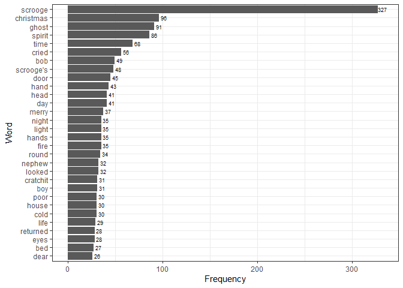

Assignment B4 Option A Exercise 1
================

``` r
# Sources of data
library(gutenbergr) # includes functions required to load texts from Project Gutenberg
```

    ## Warning: package 'gutenbergr' was built under R version 4.3.2

``` r
# Data manipulation
library(tidytext) # includes functions required to tidy text data
```

    ## Warning: package 'tidytext' was built under R version 4.3.2

``` r
library(dplyr) # includes functions required for data wrangling
```

    ## 
    ## Attaching package: 'dplyr'

    ## The following objects are masked from 'package:stats':
    ## 
    ##     filter, lag

    ## The following objects are masked from 'package:base':
    ## 
    ##     intersect, setdiff, setequal, union

``` r
library(stringr) # includes functions required for string manipulation and detection
library(forcats) # includes functions to manipulate factors and levels in data

# Data visualization
library(ggplot2) # includes functions required for data visualization
```

# 1.0 A Christmas Carol by Charles Dickens

The following code retrieves *A Christmas Carol* by Charles Dickens from
the **Project Gutenberg** database.

``` r
xmascarol_crude <- gutenberg_download(19337)
```

    ## Determining mirror for Project Gutenberg from https://www.gutenberg.org/robot/harvest

    ## Using mirror http://aleph.gutenberg.org

``` r
print(xmascarol_crude)
```

    ## # A tibble: 3,451 × 2
    ##    gutenberg_id text                    
    ##           <int> <chr>                   
    ##  1        19337 "A CHRISTMAS CAROL"     
    ##  2        19337 ""                      
    ##  3        19337 "By CHARLES DICKENS"    
    ##  4        19337 ""                      
    ##  5        19337 "ILLUSTRATED BY"        
    ##  6        19337 "GEORGE ALFRED WILLIAMS"
    ##  7        19337 ""                      
    ##  8        19337 "New York"              
    ##  9        19337 "THE PLATT & PECK CO."  
    ## 10        19337 ""                      
    ## # ℹ 3,441 more rows

## 1.1 Cleaning the data for text mining

Here is a tibble of the text with line and chapter denotations.

``` r
xmascarol_df <- xmascarol_crude %>% 
  select(text) %>% 
  mutate(line = row_number(),
         chapter = cumsum(str_count(text, "STAVE(?=\\s[A-Z]+)")))
print(xmascarol_df)
```

    ## # A tibble: 3,451 × 3
    ##    text                      line chapter
    ##    <chr>                    <int>   <int>
    ##  1 "A CHRISTMAS CAROL"          1       0
    ##  2 ""                           2       0
    ##  3 "By CHARLES DICKENS"         3       0
    ##  4 ""                           4       0
    ##  5 "ILLUSTRATED BY"             5       0
    ##  6 "GEORGE ALFRED WILLIAMS"     6       0
    ##  7 ""                           7       0
    ##  8 "New York"                   8       0
    ##  9 "THE PLATT & PECK CO."       9       0
    ## 10 ""                          10       0
    ## # ℹ 3,441 more rows

In order to determine the most commonly used words, the above tibble
will need to be restructured to only contain one word per row, and
standardize the caps lock to ensure words at the beginning vs middle of
a sentence correspond to a single identifier.

``` r
xmascarol_words <- xmascarol_df %>% unnest_tokens(word, text) 
print(xmascarol_words)
```

    ## # A tibble: 29,599 × 3
    ##     line chapter word       
    ##    <int>   <int> <chr>      
    ##  1     1       0 a          
    ##  2     1       0 christmas  
    ##  3     1       0 carol      
    ##  4     3       0 by         
    ##  5     3       0 charles    
    ##  6     3       0 dickens    
    ##  7     5       0 illustrated
    ##  8     5       0 by         
    ##  9     6       0 george     
    ## 10     6       0 alfred     
    ## # ℹ 29,589 more rows

Next, “stopwords” will need to be removed to determine which meaningful
words appear most often in the text. Stopwords were referenced from
`tidytext::stop_words`, including stopwords from three lexicons.

``` r
xmascarol_words_clean <- xmascarol_words %>% anti_join(stop_words, by = "word")
print(xmascarol_words_clean)
```

    ## # A tibble: 10,210 × 3
    ##     line chapter word       
    ##    <int>   <int> <chr>      
    ##  1     1       0 christmas  
    ##  2     1       0 carol      
    ##  3     3       0 charles    
    ##  4     3       0 dickens    
    ##  5     5       0 illustrated
    ##  6     6       0 george     
    ##  7     6       0 alfred     
    ##  8     6       0 williams   
    ##  9     8       0 york       
    ## 10     9       0 platt      
    ## # ℹ 10,200 more rows

## 1.2 Determining the most common words used

Lastly, the above tibble can be manipulated to output a tibble of words
sorted by frequency at which they appear.

``` r
xmascarol_words_clean_n <- 
  xmascarol_words_clean %>% 
  group_by(word) %>% 
  summarize(frequency = n()) %>% 
  arrange(desc(frequency))

print(xmascarol_words_clean_n)
```

    ## # A tibble: 3,958 × 2
    ##    word      frequency
    ##    <chr>         <int>
    ##  1 scrooge         327
    ##  2 christmas        96
    ##  3 ghost            91
    ##  4 spirit           86
    ##  5 time             68
    ##  6 cried            56
    ##  7 bob              49
    ##  8 scrooge's        48
    ##  9 door             45
    ## 10 hand             43
    ## # ℹ 3,948 more rows

## 1.3 Plotting the most common words used

Here is a bar chart of the 30 most commonly used words in *A Christmas
Carol* by Charles Dickens.

``` r
ggplot(data = xmascarol_words_clean_n[1:30, ],
       aes(x = reorder(word, frequency), # ordering the bars according to frequency
           y = frequency)) +
  geom_col() +
  geom_text(aes(label = frequency),
             size = 2.5,
             nudge_y = 5) +
  labs(x = "Word",
       y = "Frequency") +
  coord_flip() +
  theme_bw()
```

<!-- -->
